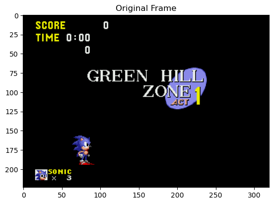
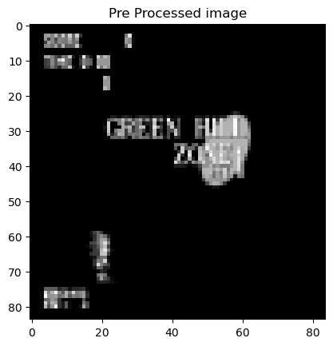
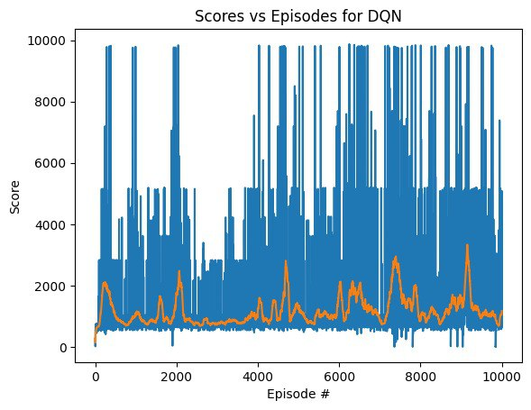
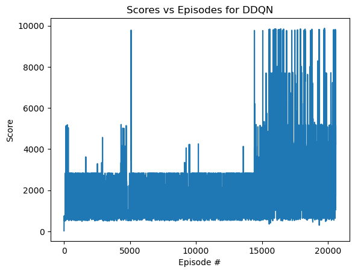
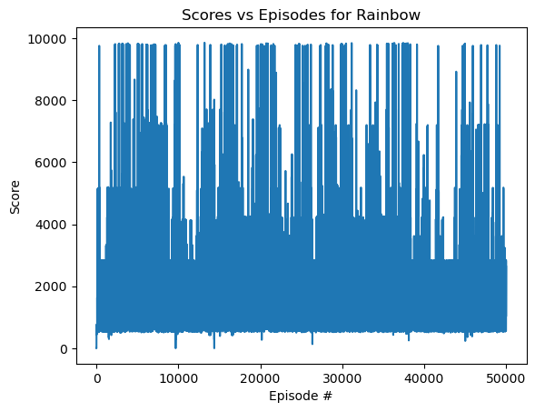

# RL Report
**Authors:** Sofya Polozova, Dmitrij Kamyshnikov

## Abstract
The Sonic the Hedgehog Reinforcement Learning project, where we trained AI agents to play through the iconic Green Hill Zone using deep reinforcement learning techniques. The goal was to teach an agent to effectively navigate the first level of Sonic, which involves complex control tasks like speed, precision, and long-term planning.

## Gym Retro
Underlying the Sonic benchmark is Gym Retro, a project aimed at creating RL environments from various emulated video games. At the core of Gym Retro is the gym-retro Python package, which exposes emulated games as Gym environments. The gym-retro package includes a dataset of games. Each game in the dataset consists of a ROM, one or more save states, one or more scenarios, and a data file. Here are high-level descriptions of each of these components:
- **ROM** – the data and code that make up a game; loaded by an emulator to play that game.
- **Save state** – a snapshot of the console’s state at some point in the game. For example, a save state could be created for the beginning of each level.
- **Data file** – a file describing where various pieces of information are stored in console memory. For example, a data file might indicate where the score is located.
- **Scenario** – a description of done conditions and reward functions. A scenario file can reference fields from the data file.

## Sonic The Hedgehog environment
Each Sonic game is divided up into zones, and each zone is further divided up into acts. While the rules and overarching objective remain the same throughout the entire game, each zone has a unique set of textures and objects. Different acts within a zone tend to share these textures and objects, but differ in spatial layout. We will refer to a (ROM, zone, act) tuple as a “level”. The Sonic games provide a rich set of challenges for the player. For example, some zones include platforms that the player must jump on in order to open doors. Other zones require the player to first jump on a lever to send a projectile into the air, then wait for the projectile to fall back on the lever to send the player over some sort of obstacle. One zone even has a swing that the player must jump off of at a precise time in order to launch Sonic up to a higher platform. We used  the first Green Hill Zone level in Sonic.

## Actions
Each player can choose from eight actions of discrete action space:
- **No Operation (NOP) (Action 0)**: This is an empty action that does not affect the state of the game. The agent does not take any action.
- **Left (Action 1)**: The agent moves to the left.
- **Right (Action 2)**: The agent moves to the right.
- **Left, Down (Action 3)**: The agent moves to the left and slightly down.
- **Right, Down (Act 4)**: The agent moves to the right and slightly down.
- **Down (Action 5)**: The agent only moves downwards.
- **Down, B (Action 6)**: The agent moves down and performs action B (e.g. jump or attack).
- **B (Action 7)**: The agent performs action B (for example, a jump or an attack).

## Episode Boundaries
Experience in the game is divided up into episodes, which roughly correspond to lives. At the end of each episode, the environment is reset to its original save state. Episodes can end on three conditions:
- The player completes a level successfully.
- The player loses a life.
- 4500 timesteps have elapsed in the current episode. This amounts to roughly 1.15 minutes of in-game time.

The environment should only be reset if one of the aforementioned done conditions is met. Agents should not use special APIs to tell the environment to start a new episode early.
In our project we decided to omit the boss fights that often take place at the end of a level. For levels with boss fights, our done condition is defined as a horizontal offset that the agent must reach before the boss fight. Although boss fights could be an interesting problem to solve, they are fairly different from the rest of the game. Thus, we chose not to include them so that we could focus more on exploration, navigation, and speed.

## Observations
A gym-retro environment produces an observation at the beginning of every timestep. This observation is always a 24-bit RGB image, but the dimensions vary by game. For Sonic, the screen images are 320 pixels wide and 224 pixels tall.

## Preprocessing And Stacking Frames
Preprocessing Frames is an important step, because we want to reduce the complexity of our states to reduce the computation time needed for training. The original frames are represented on the Figure 1:

Stacking frames is really important because it helps us to have a sense of motion to our Neural Network.

Steps:
- Grayscale each of our frames (because color does not add important information ).
- Crop the screen (in our case we remove the part below the player because it does not add any useful information).
- We normalize pixel values.
- Finally we resize the preprocessed frame to (84 * 84).
- Stacking Frames 4 frames together.
- Frame after preprocessing is represented on Figure 2.

There are a lot of strategies which can be used to solve this problem. We decided to focus on Deep Q-Networks (DQNs), Rainbow and Dueling DQN.

## Deep Q-Network (DQN)
Deep Q-Networks (DQNs) approximate the function Q(s,a), which represents the value of taking action in state s. In Q learning, the metric used to evaluate an action a is the expected sum of discounted future rewards acting optimally from state s. This idea is formalized by the Bellman Equation: $$Q(s,a) = r + y(max(Q(s’, a’))$$

Where r is the reward observed after taking action in state s and y is a discount factor.

As an agent explores its environment, it takes actions and observes the resulting rewards. These experiences (initial state, selected action, reward, next state) are then used to update the value associated with the initial state and selected action. Provided sufficient exploration and training, the q values will converge to an approximation of the optimal function mapping state action pairs to the optimal action overtime.

At their most basic, Q-networks simply iteratively update their approximation of the Q-function as each observation is made. Standard DQNs have proven to be very strong solutions to many difficult reinforcement learning problems. However, the basic DQN can be improved dramatically through various methods which enhance convergence reliability and speed.

The following models are discrete extensions of the basic DQN model. The combination of all extensions into a single agent forms what Google’s Deepmind calls a "Rainbow DQN". While each extension generally improves the training efficiency and accuracy of the agent, the Rainbow DQN has been shown to outperform all sub-combinations of the following DQN additions in many Arcade Learning Environments.

## Dueling DQN

Dueling DQNs attempt to gain a deeper understanding of the environment by breaking down the q function $$Q(s,a)$$ which represents the value of taking action $$a$$ in state $$s$$ into two separate functions: $$V(s)$$ - the value of being in state $$s$$ and $$A(s,a)$$ - the advantage of taking action $$a$$ over taking all other possible actions. Intuitively, the dueling architecture can separate the value of simply existing in a state $$V(s)$$ from the value associated with acting in the state $$A(s,a)$$. Dueling DQNs learn $$V(s)$$ and $$A(s,a)$$ within their inner layers, then sum the output of the two layers to yield the q values based on the relation: $$V(s) + A(s,a) = Q(s,a)$$.

## Rainbow

We use a specific variant of DQN, namely Rainbow, which performs particularly well on the ALE. We retain the architecture and most of the hyper-parameters from, with a few small changes. We use a replay buffer size of 100000 instead of 1M to lower the algorithm’s memory consumption. We do not use hyper-parameter schedules; rather, we simply use the initial values of the schedules from. Since DQN tends to work best with a small.

We use an environment wrapper that rewards the agent based on deltas in the maximum 8 x-position. This way, the agent is rewarded for getting further than it has been before (in the current episode), but it is not punished for backtracking in the level. This reward preprocessing gives a sizable performance boost.

## Results

All agents demonstrate the ability to navigate through challenging obstacles and terrain in the Sonic game. The learning process involves adapting to the game dynamics, optimizing action choices, and maximizing score.

### DQN

We trained for approximately 15 hours. The results of training are presented on Figure 3. The best-performing DQN agent achieved a score exceeding approximately 10,000 points. After about 14,000 iterations this maximum score is achieved more often.

The average score for episodes has significant variation. In some episodes, the agent reaches high scores (close to the maximum value of 10,000), while in others the scores are much lower (about 500 or even less). It may be due to different environmental conditions, accidental agent actions, or other factors.

The average score gradually improves. This may indicate that the agent is successfully learning and adapting to the environment.

**Figure 3 - result of training DQN**

### Dueling DQN

The Dueling DQN algorithm was trained for approximately 17 hours and the results of training are presented on Figure 4. There is less variation until 15,000 episodes, but the score is quite low at 3,000. This algorithm also can achieve quite a high score but only after 15000 episodes.

**Figure 4 - result of training DDQN**

### Rainbow

Rainbow algorithm was trained for approximately 10 hours. The result of the scores during training is presented on Figure 5. This algorithm shows more stability. After 5 000 episodes agent can reach the finish of the level. But the score variability remained high variation too, fluctuating between 600 and approximately 10,000 even after 30,000 episodes.

**Figure 5 - result of training Rainbow**

## Conclusion

This project provided a valuable opportunity to assess different reinforcement learning approaches within the Sonic the Hedgehog environment. While our trained agents successfully achieved a positive average score post-training, there are clear opportunities for advancement. Specifically, fine-tuning the hyperparameters could not only enhance but also bring more stability to the learning process. Additionally, developing a more complex reward function would allow the agent to navigate and understand the environment with greater efficacy. In pursuit of these improvements, our future efforts will be dedicated to refining these key aspects, aiming to significantly boost the efficiency of our reinforcement learning models. This project underscores the potential of reinforcement learning in complex environments and sets the stage for future research in this exciting field.
